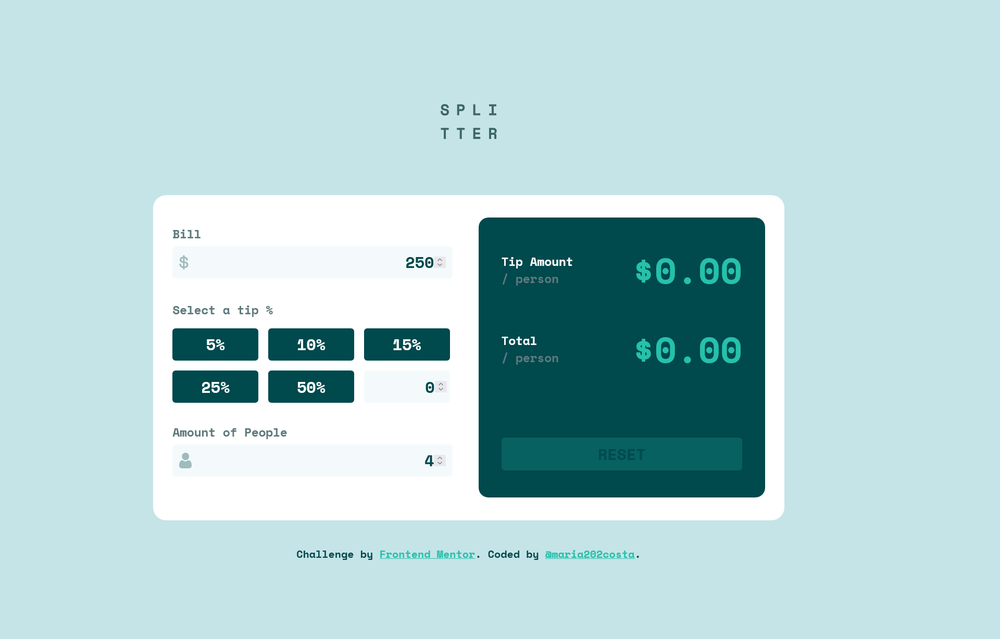

# Frontend Mentor - Tip calculator app solution

This is a solution to the [Tip calculator app challenge on Frontend Mentor](https://www.frontendmentor.io/challenges/tip-calculator-app-ugJNGbJUX). Frontend Mentor challenges help you improve your coding skills by building realistic projects.

## Table of contents

- [Overview](#overview)
- [The challenge](#the-challenge)
- [Screenshot](#screenshot)
- [Links](#links)
- [My process](#my-process)
- [Built with](#built-with)
- [What I learned](#what-i-learned)
- [Author](#author)

## Overview

Note: english is not my first language, sorry for any mistake.

This project is a tip calculator, using inputs and buttons for show the results on the right side of the calculator, you need to give the bill value and the amount of people, where this bill will be divised by this number, and for the result you need to choose the percentage of tip of the total per person, and the result will appear, two results: the tip per person and the bill per person, you can also customize the tip you want. The project was made with the markup language HTML for the structure, CSS for style and JavaScript for the interative part.

### The challenge

Users should be able to:

- View the optimal layout for the app depending on their device's screen size(Media Queries will be updated!)
- See hover states for all interactive elements on the page
- Calculate the correct tip and total cost of the bill per person

### Screenshot

()

### Links

- Solution URL: [The solution URL](https://www.frontendmentor.io/solutions/a-interative-tip-calculator-using-javascript-HR7SAlolQq)
- Live Site URL: [Live Site URL](https://tip-calculator-peach-eight.vercel.app/)

## My process

The HTML document i used what i see to be most semantic and intuitive as possible, looking at the design image. The CSS was made following the HTML document for best understading, using the relation of the parents tags and childs, the division of the main tag in two was perfectly calculate, together with the padding,margin and height. The JavaScript was more challenging, the funcionalite of the buttons was made using the forEach and click event, the custom tip input was made with the submit event, according with the type. The hability of reset the results was made with another click event, and for show the results was used a function, the calculations was made for each value and put together in only two variables.

### Built with

- Semantic HTML5 markup
- CSS custom properties
- Flexbox
- CSS Grid
- JavaScript Code
- ForEach function
- Condicionals(if e else);
- Variables

### What I learned

I learned to use listeners of event in arrays functions, how to use functions who are out of the main event listener, my big difficult in this project was made the buttons functionals with the inputs, this project made me understand better how to make it with in another projects. I'm prideful of all the JavaScript code of this project.

## Author

- Frontend Mentor - [@maria202costa](https://www.frontendmentor.io/profile/maria202costa)
